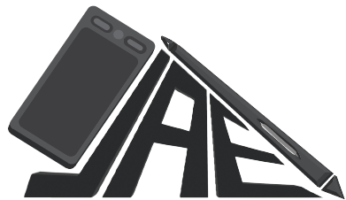

<a name="readme-top">

<br/>

<br />
<div align="center">
  <a href="https://github.com/zyx-0314/">
  <!-- TODO: If you want to add logo or banner you can add it here -->
    
  </a>
<!-- TODO: Change Title to the name of the title of your Project -->
  <h3 align="center">Jaz Estayo's Portfolio</h3>
</div>
<!-- TODO: Make a short description -->
<div align="center">
  Jazmine Estayo's Midterm Project.
</div>

<br />

<!-- TODO: Change the zyx-0314 into your github username  -->
<!-- TODO: Change the WD-Template-Project into the same name of your folder -->


---

<br />
<br />

<!-- TODO: If you want to add more layers for your readme -->
<details>
  <summary>Table of Contents</summary>
  <ol>
    <li>
      <a href="#overview">Overview</a>
      <ol>
        <li>
          <a href="#key-components">Key Components</a>
        </li>
        <li>
          <a href="#technology">Technology</a>
        </li>
      </ol>
    </li>
    <li>
      <a href="#rule,-practices-and-principles">Rules, Practices and Principles</a>
    </li>
    <li>
      <a href="#resources">Resources</a>
    </li>
  </ol>
</details>

---

## Overview

<!-- TODO: To be changed -->
<!-- The following are just sample -->
Description of the project in details.

Guiding Question:
- What is the project
- Whats the purpose
- What are key components
- What technology used and how it is used

### Key Components
<!-- TODO: List of Key Components -->
<!-- The following are just sample -->
- Single Page Website
- Parallax transition
- Transactional

### Technology
<!-- TODO: List of Technology Used -->


## Rules, Practices and Principles
1. Always use `WD-` in the front of the Title of the Project for the Subject followed by your custom naming.
2. Do not rename any .html files; always use `index.html` as the filename.
3. Place Files in their respective folders.
4. All file naming are in camel case.
   - Camel case is naming format where there is no white space in separation of each words, the first word is in all lower case while the succeding words first letter are in upper followed by lower cased letters.
   - ex.: buttonAnimatedStyle.css
5. Use only `External CSS`.
6. Renaming of Pages folder names are a must, and relates to what it is doing or data it holding.
7. File Structure to follow below.

```
WD-ProjectName
└─ assets
|   └─ css
|   |   └─ style.css
|   └─ font
|   |   └─ chevaDisplay.otf
|   |   └─ horizonOutline.otf
|   |   └─ madsense.otf
|   |   └─ montserratBlack.ttf
|   |   └─ musticaproSemibold.otf
|   |   └─ shameimaruSans.ttf
|   └─ img
|   |   └─ backgroundAssets
|   |     └─ jaesohBackground.png
|   |   └─ softwarePictures
|   |     └─ ai.png
|   |     └─ csp.png
|   |     └─ maya.png
|   |     └─ ps.png
|   |     └─ vp.png
|   |   └─ works
|   |     └─ commArtwork1.png
|   |     └─ commArtwork2.png
|   |     └─ commArtwork3.png
|   |     └─ commArtwork4.png
|   |     └─ featuredWork.png
|   |     └─ hololiveArtwork1.jpg
|   |     └─ hololiveArtwork2.jpg
|   |     └─ hololiveArtwork3.jpg
|   |     └─ hololiveArtwork4.jpg
|   |     └─ hololiveArtwork5.png
|   |     └─ kiniotoArtwork.png
|   |     └─ kiniotoArtwork2.png
|   |     └─ kiniotoArtwork3.png
|   |   └─ aboutMePicture.png
|   |   └─ jaeLogo.png
|   |   └─ me.png
|   └─ js
|       └─ script.js
└─ pages
|  └─ pageName
|     └─ assets
|     |  └─ css
|     |  |  └─ style.css
|     |  └─ img
|     |  |  └─ fileWith.jpeg/.jpg/.webp/.png
|     |  └─ js
|     |     └─ script.js
|     └─ index.html
└─ index.html
└─ readme.md
```

## Resources

<!-- TODO: Add References -->
| Title | Purpose | Link |
|-|-|-|

| Portfolio Web Design | Inspo for the overall website design | https://www.behance.net/gallery/202610997/Galleon-Personal-Portfolio-Web-Design?tracking_source=search_projects|web+design+portfolio&l=14

| Cheva Display Font | Font used in year headings | https://www.fontspace.com/cheva-display-font-f77288
| Madsense Font | Font used in navigation buttons | https://www.fontspace.com/madsense-font-f57755
| Shameimaru Font | Font used in some headings of the page  | https://www.fontspace.com/shameimaru-sans-font-f27896
| Montserrat Black | Font used in some text of the page  | https://www.fontspace.com/montserrat-font-f16544
| MusticaPro | Font used in some headings of the page  | https://www.dafont.com/mustica-pro.font
| Horizon Outlined | Font used in main headings of different sections  | https://www.dfonts.org/wp-content/uploads/fonts/Horizon-updated.zip

| Text aligned with Image | Code used and revised to align image next to text in the Home Section | https://stackoverflow.com/questions/69707160/text-floating-left-and-image-on-the-right
| Space between headings | Code used and revised to remove spaces between headings in the overall content of the website | https://stackoverflow.com/questions/40822576/removing-space-between-h1-and-h2
| Columns | Code used and revised to make 5 columns for Skills Section | https://www.shecodes.io/athena/4000-creating-a-grid-with-five-columns-with-css
| Aligning images side by side | Code used for aligning images for Portfolio Section | https://www.geeksforgeeks.org/how-to-align-images-side-by-side-using-css/
| Aligning image to center | Code used to center images | https://www.w3schools.com/howto/howto_css_image_center.asp
| Image resize | Code used tresize uneven images | https://www.browserstack.com/guide/how-to-resize-image-using-css
https://www.bannerbear.com/blog/how-to-overlay-text-on-an-image-in-html-and-css/
https://stackoverflow.com/questions/69004094/filling-a-css-grid-from-bottom-up-instead-of-top-down
| Image Overflow Hidden | Code used and revised for Portfolio Section | https://stackoverflow.com/questions/26101774/how-to-trim-off-image-in-css
| Flexbox Layout Pattern | Code used and revised for Experience Section | https://stackoverflow.com/questions/39141646/flexbox-layout-pattern-3-squares-ordered-1-large-left-2-small-right-stacked
| Utilizing border-radius property | Code used and revised for adding roundness in images for Portfolio Section | https://www.w3schools.com/cssref/css3_pr_border-radius.php
| Aligning text beside button | Code used and revised for aligning contact button beside text | https://stackoverflow.com/questions/6632340/place-a-button-right-aligned
https://www.w3schools.com/howto/howto_css_outline_buttons.asp
